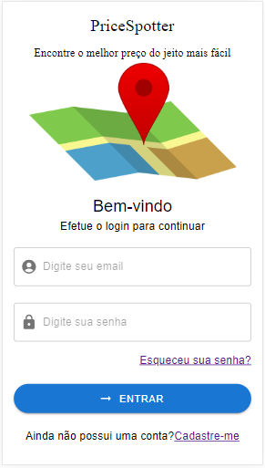
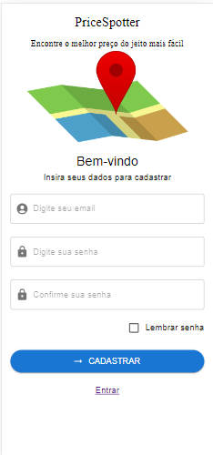
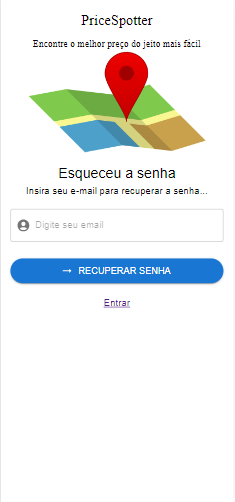
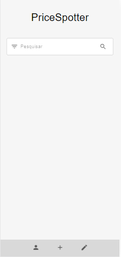
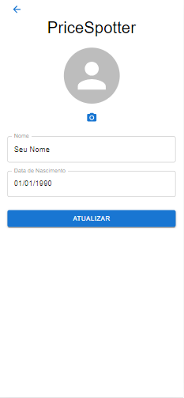
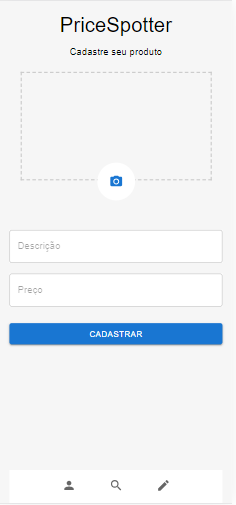
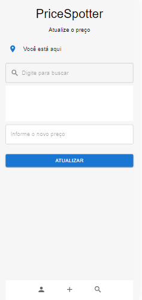

# APLICATIVO PRICESPOTTER 

## PROJETO DE CONCLUSÃO DA DISCIPLINA DESENVOLVIMENTO DE APPS HÍBRIDOS COM PWA

Este projeto foi criado com React Js implementando fundamentos de UX em aplicações web progressivas.

Essa é uma aplicação que permitirá consulta de preços de produtos baseados em sua localização. 

## Funcionalidades

* Login
* Registro
* Recuperação de senha
* Gestão de perfil
* Tela home para busca de produtos
* Cadastro de produtos
* Atualização de preços de produtos

 

### Tela de Login

 

### Tela de Registro

 

### Tela de Recuperação de senha

 

### Tela Home

 

### Tela Perfil

 

### Tela de Cadastro

 

### Tela de atualização de preços

 

